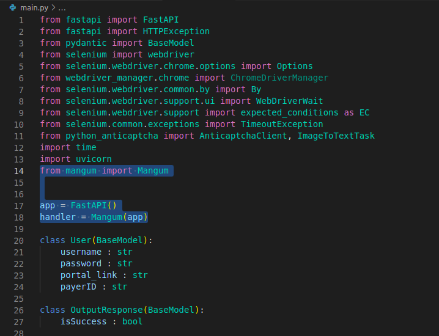
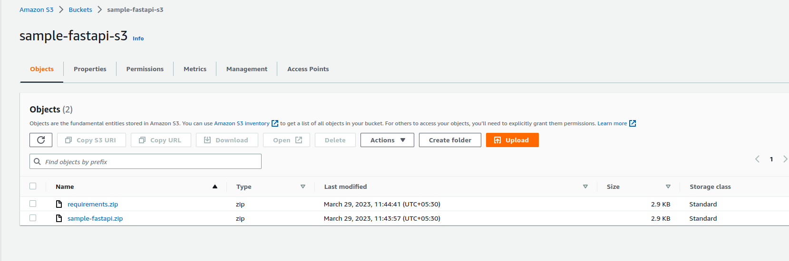
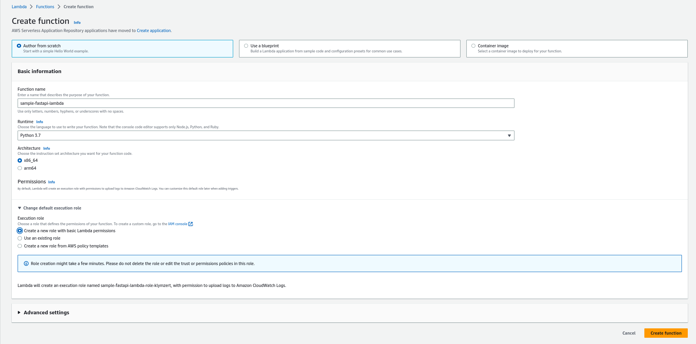
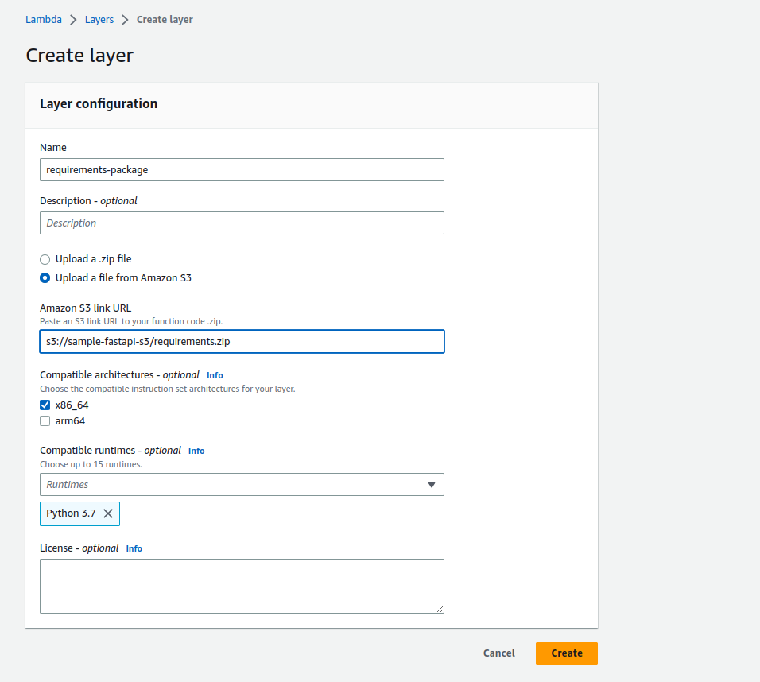
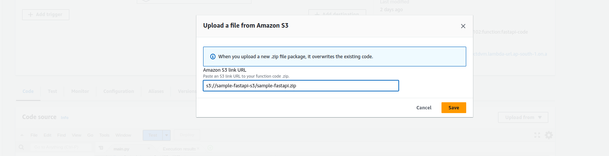
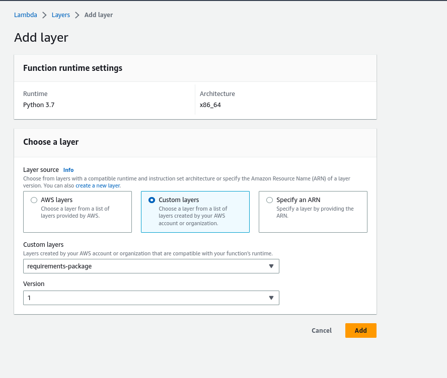
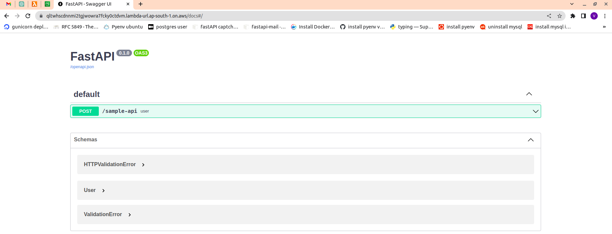

# Deploying a FastAPI project on AWS Lambda

## Introduction
This guide outlines the steps required to deploy a FastAPI project on AWS Lambda using a separate requirements package and code-only zip file.

## Prerequisites:

Before you begin, you will need the following:

1. A sample FastAPI project
2. An AWS account with access to AWS Lambda and S3 services to deploy code

For this example, we will use a FastAPI project named `sample-fastapi-project` and an S3 bucket named `sample-fastapi-s3`. We will also create an AWS Lambda function named `sample-fastapi-lambda`.

## Step 1 — Create a virtual environment to isolate our app dependencies. 
```
  $  python3 -m venv venv/
```

## Step 2 - Activate the environment:
```
  $  source venv/bin/activate
```

## Step 3 - Install dependencies that are required for this project:
```
  $  pip install -r requiements.txt
  
```

## Step 4 - Add Mangum to the FastAPI code:
```  
  $ pip install mangum
  
  $ pip freeze > requiements.txt

```
Import the Mangum module in your FastAPI code:
```
  from mangum import Mangum
```

Wrap the FastAPI app with Mangum:
```
  app = FastAPI()
  handler = Mangum(app)
```

Mangum allows us to wrap the API with a handler that we will package and deploy as a Lambda function in AWS.




## Step 5 - Create a separate requirements package zip file
```
  $  pip3 install -r requirements.txt -t ./packages
  $  cd packages
  $  zip -r9 ../requirements.zip .
```
This will create a seperate requirements.zip file

## Step 6 - Create a code-only zip file

Create a separate zip file containing only your project's code, including the `main.py` file. Name this file `sample-fastapi.zip`.

```
  # if all the code is in main.py file, then
  $  zip sample-fastapi.zip main.py
  
  # Add other files to created zip if required
  $  zip sample-fastapi.zip -u <python_file>
  
```

## Step 7 - Upload the requirements package and code-only zip files to S3(sample-fastapi-s3):

1. Go to the s3 bucket and click on upload icon to uplaod both files directly. 




## Step 8 - Create a new Lambda function:

Navigate to the Lambda service in the AWS Console and click `Create function`. Select `Author from scratch` and enter `sample-fastapi-lambda` as the function name. Choose `Python 3.7` as the runtime.
 
 
    

## Step 9 - Add the requirements package as a Lambda layer:

In the Lambda function page, navigate to the `Layers` section and click `Add a layer` > `Layers` > `create layer`. Choose `Upload a file from Amazon S3` and copy the `S3 URI` of the `requirements.zip` file that you uploaded to S3 in Step 7. Enter a name for the layer and click `Create`.

 


## Step 10 - Add the code-only zip file to the Lambda function:

In the Lambda function page, navigate to the `Function code` section and choose Upload from `Amazon S3 location` under `Code source`. Copy the `S3 ULI` of `sample-fastapi.zip` file that you uploaded to S3 in Step 7.

 


## Step 11 - Set the Lambda function handler:

1. In the Lambda function page, scroll down to the `Runtime settings` section and set the handler name to `main.handler`.
2. It will execute handler function under main.py file.
3. Check Step-4 for reference.


## Step 12 - Configure the Lambda function:
#### In the Lambda function page, navigate to the `Configuration` section and under `General configuration` set the following parameters:

1. Memory (RAM): 1024 MB
2. Memory (ROM): 512 MB
3. Timeout: 1 minute

#### Click on `Environment variables` 
 Set any environment variables required by your FastAPI project

#### In the Lambda function page, scroll down to the `Layers` > `Add layer`.
 1. Select`custom layers` in ``layer source
 2. Add the requirements package layer that you created in Step 9
 3. Choose `Version` and Click `Add`
 
    


#### Add Function URL
 1. In the Lambda function page, navigate to the `Configuration` section and under `Function URL`, Click `Create function url`
 2. Set `Auth type` as `None`.
 3. Click Save
 
 ## Step 13 - Test the Lambda function:
  In the Lambda function page, Copy "Function Url" and test your function in any browser.
  just add.. `<Function Url>/docs` in URL
  
  You should see the output from your FastAPI project's APIs.
  
  
   

  
Congratulations! You have successfully deployed a FastAPI project on AWS Lambda.
 

